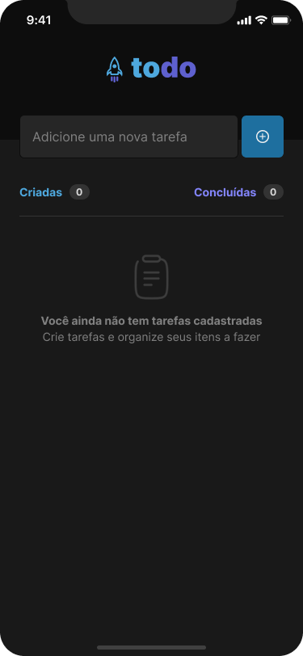
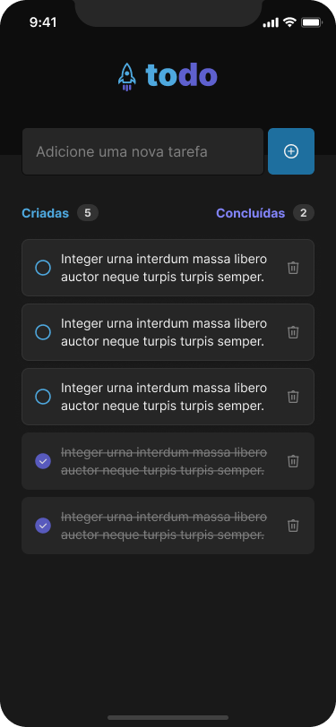

<h1 align="center"> ToDo App</h1>




## 🛠 Installation & Set Up

1. Clone the repository

   ```sh
   git clone https://github.com/PaulosSouza/todo-app-react-native react-native
   ```

2. Install dependencies

   ```sh
   npm i
   ```

3. Start the development server.

   ```sh
   npm run android # for android
   npm run ios # for ios
   ```

## 🧑‍💻 Tecnologies Reference

- [Expo](https://expo.dev/)
- [React Native](https://reactnative.dev/)
- [Typescript](https://www.typescriptlang.org/)

#### Linters & Formatters

- [Eslint](https://eslint.org/)
- [Prettier](https://prettier.io/)

## 🚧 Goals
- [X] Add a new task
- [X] Mark and unmark a task as completed
- [X] Remove a task from the list
- [X] Display the progress of task completio